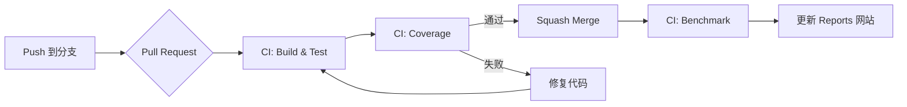

# 开发流程规范

> 本文档规范 Sideline 项目的开发流程，适用于单人及多人协作开发。

---

## 分支策略：轻量级 GitHub Flow

采用简化版 [GitHub Flow](https://docs.github.com/en/get-started/quickstart/github-flow)，保持流程轻量的同时确保代码质量。

```
main (稳定，可部署)
  ↑
  ├─ feature/fp-math       ← 新功能开发
  ├─ fix/ci-artifact       ← Bug 修复
  ├─ refactor/window-mgr   ← 代码重构
  └─ docs/api-guide        ← 文档更新
```

### 分支命名规范

| 类型 | 前缀 | 示例 |
|------|------|------|
| 新功能 | `feature/` | `feature/fp-sqrt-optimization` |
| Bug 修复 | `fix/` | `fix/window-drag-boundary` |
| 重构 | `refactor/` | `refactor/entity-manager` |
| 文档 | `docs/` | `docs/benchmark-guide` |
| 实验性 | `experiment/` | `experiment/ecs-v2` |

---

## 开发工作流

### 1. 开始新工作

```bash
# 确保本地 main 是最新的
git checkout main
git pull origin main

# 创建功能分支（使用 kebab-case 命名）
git checkout -b feature/your-feature-name
```

### 2. 开发阶段

```bash
# 常规提交（保持提交粒度适中）
git add .
git commit -m "feat: 添加 FP.FastSqrt 实现"

# 推送分支到远程
git push -u origin feature/your-feature-name
```

**提交信息规范**（遵循 [Conventional Commits](https://www.conventionalcommits.org/)）：

| 类型 | 说明 | 示例 |
|------|------|------|
| `feat` | 新功能 | `feat: 实现窗口拖拽功能` |
| `fix` | Bug 修复 | `fix: 修复除零错误处理` |
| `refactor` | 代码重构 | `refactor: 优化 FP 乘法实现` |
| `test` | 测试相关 | `test: 添加边界值测试用例` |
| `docs` | 文档更新 | `docs: 更新 API 文档` |
| `ci` | CI/CD 改动 | `ci: 添加 benchmark 步骤` |
| `chore` | 杂项维护 | `chore: 更新依赖版本` |

### 3. 代码审查（Pull Request）

即使单人开发，**也必须通过 PR 合并到 main**：

1. 在 GitHub 上创建 Pull Request
2. **等待 CI 全部通过** ✅
   - Build & Test（多平台测试）
   - Code Coverage（覆盖率检查）
   - Performance Benchmark（基准测试，仅 main 分支）
3. 自我审查：检查 Files changed 标签页
4. 选择 **"Squash and merge"** 保持历史整洁
5. 删除远程分支

### 4. 清理

```bash
# 切换回 main
git checkout main
git pull origin main

# 删除本地分支
git branch -d feature/your-feature-name

# 清理已删除的远程分支引用
git fetch --prune
```

---

## 为什么必须走 PR 流程

本项目使用 GitHub Pages 从 `docs/` 文件夹部署网站，main 分支的稳定性直接影响线上文档。

| 风险场景 | PR 流程的保护作用 |
|---------|------------------|
| CI 失败 | 在合并前发现问题，避免破坏 main |
| 测试未通过 | 阻止确定性问题的代码进入主分支 |
| 覆盖率下降 | 及时发现测试遗漏 |
| 误操作提交 | PR 审查提供最后检查机会 |

---

## 单人开发快速参考

### 创建功能分支
```bash
git checkout -b feature/$(git rev-parse --abbrev-ref HEAD | sed 's/main/new-feature/')
```

### 查看分支状态
```bash
# 本地分支列表
git branch

# 查看已合并到 main 的分支（可安全删除）
git branch --merged main
```

### 紧急修复生产问题
```bash
# 从 main 切出 hotfix 分支
git checkout main
git pull
git checkout -b fix/critical-bug

# 修复、提交、PR 合并后
git checkout main
git pull
git branch -d fix/critical-bug
```

---

## 持续集成流程



### CI 任务说明

| 任务 | 触发条件 | 说明 |
|------|---------|------|
| Build & Test | 所有 push | 多平台构建（Ubuntu/Windows/macOS）+ 170 个单元测试 + 确定性验证 |
| Coverage | 所有 push | 生成代码覆盖率报告，上传 artifact |
| Benchmark | 仅 push 到 main | 性能基准测试，与覆盖率报告一同更新网站 |
| Update Reports | CI 完成后 | 将报告发布到 `docs/reports/` |

---

## 项目结构规范

### 代码组织

```
godot/
├── scripts/
│   ├── main/           # 主场景、游戏入口
│   ├── ui/             # UI 面板、控件
│   ├── lattice/        # ECS 框架核心
│   │   ├── Math/       # FP 定点数等数学库
│   │   ├── Core/       # Entity, Component, System
│   │   └── Utils/      # 工具类
│   └── window/         # 窗口管理
├── scenes/             # .tscn 场景文件
├── assets/             # 图片、音频、字体
└── tests/              # 测试项目
```

### 命名规范

| 类型 | 规范 | 示例 |
|------|------|------|
| 类名 | PascalCase | `WindowManager`, `FixedPoint` |
| 方法名 | PascalCase | `ToggleMode()`, `OnButtonPressed()` |
| 私有字段 | _camelCase | `_windowManager`, `_isDragging` |
| 常量 | PascalCase | `IdleWindowSize`, `MaxEntities` |
| 场景文件 | PascalCase | `Main.tscn`, `IdlePanel.tscn` |

---

## 参考文档

- [GitHub Flow 官方文档](https://docs.github.com/en/get-started/quickstart/github-flow)
- [Conventional Commits 规范](https://www.conventionalcommits.org/)
- [项目设计文档](../design/GameDesign.md)
